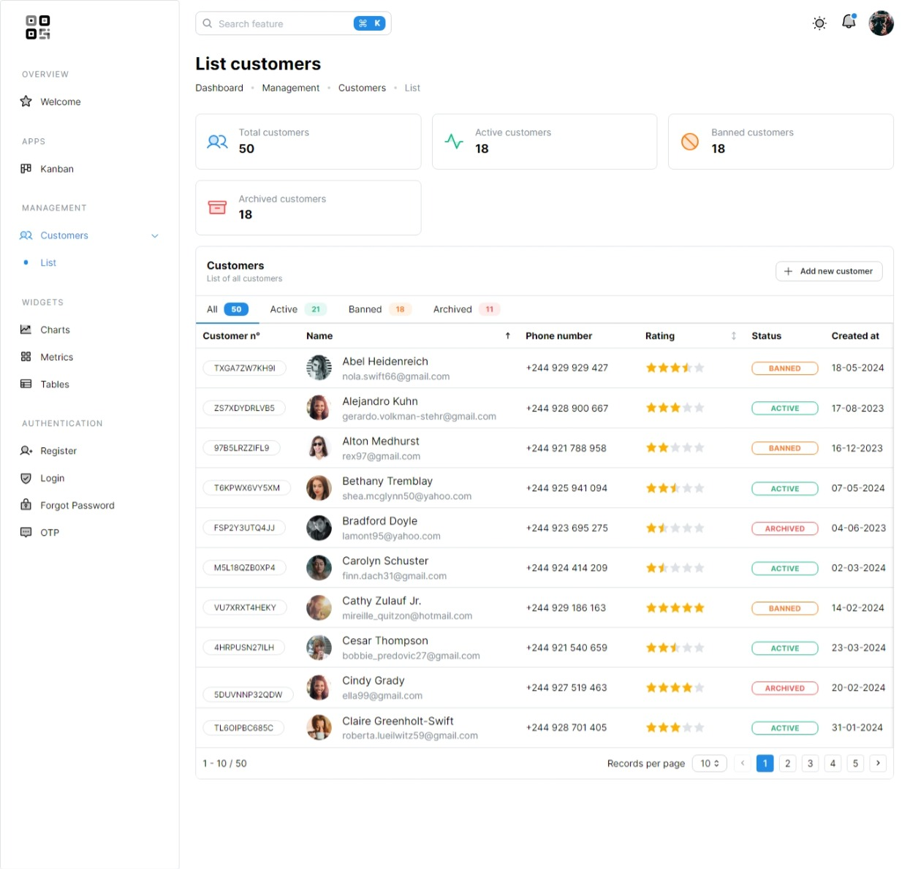
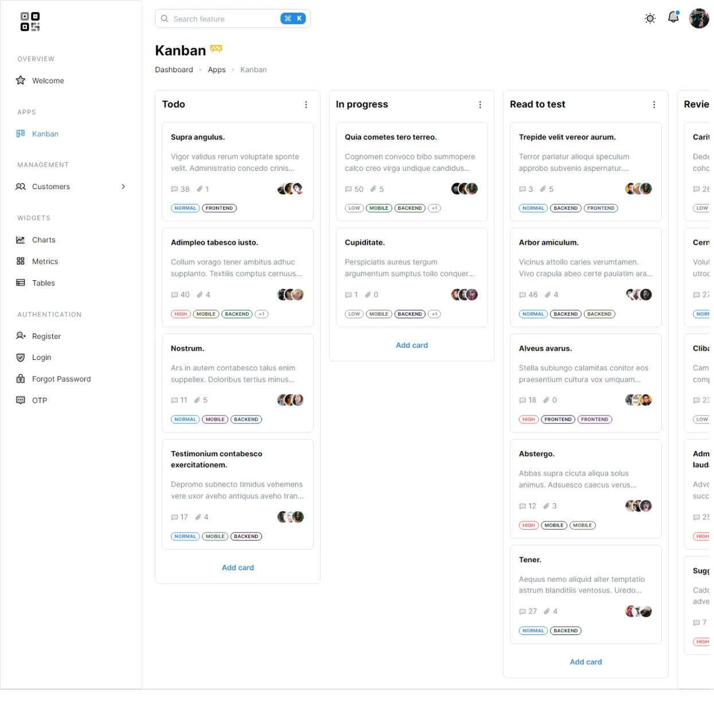
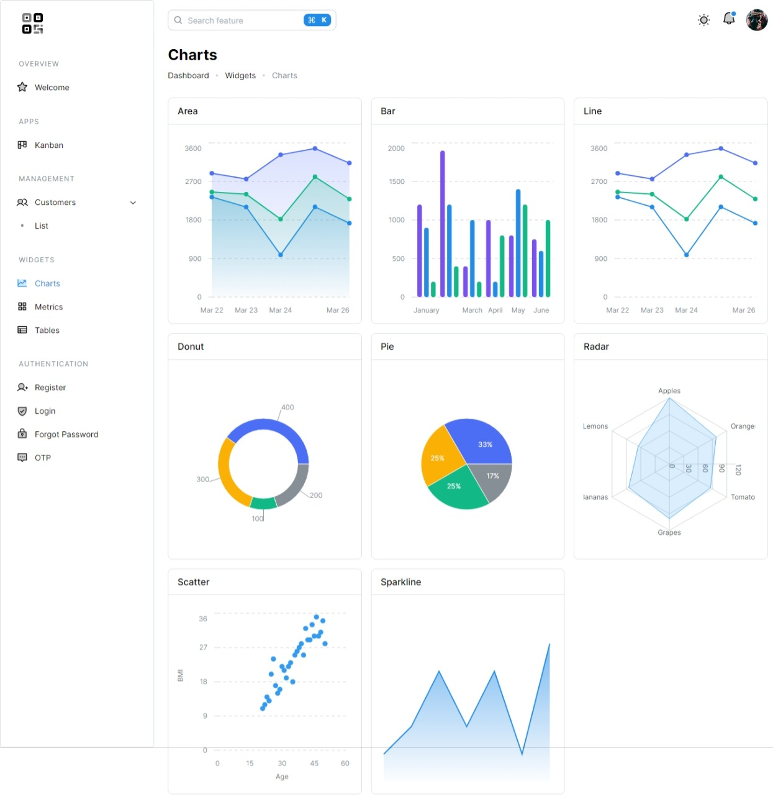
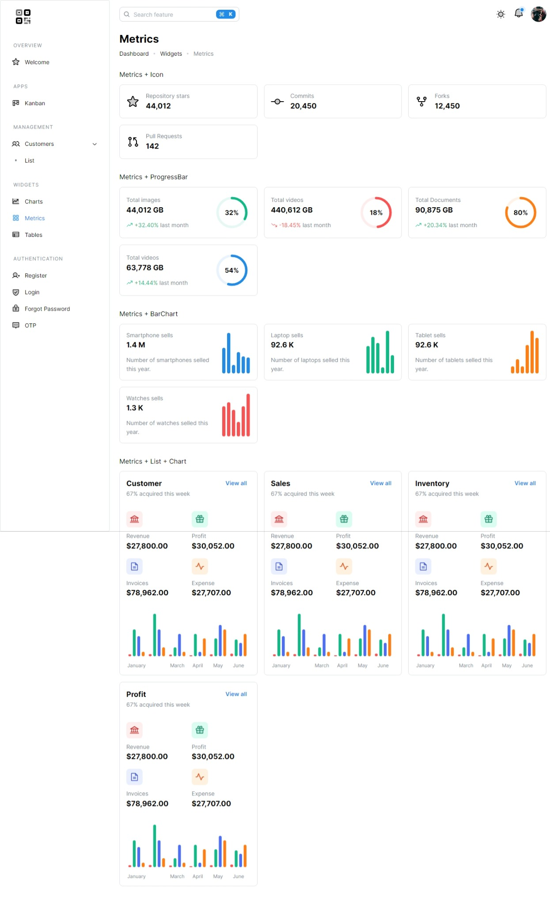
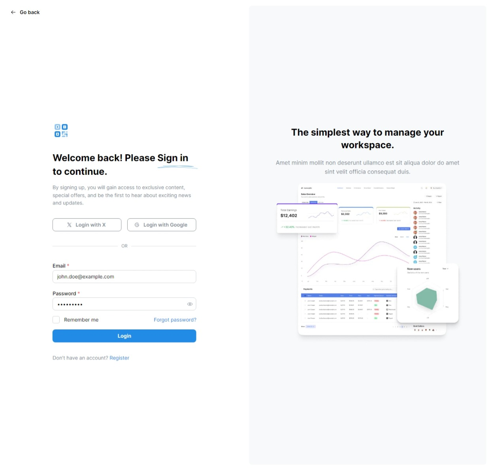
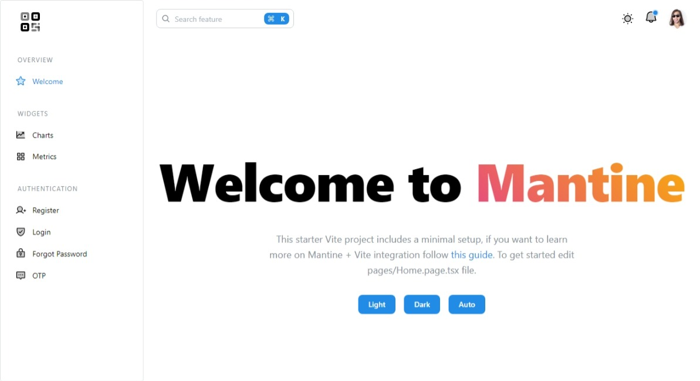

# Mantine Dashboard

A simple beautiful dashboard! This project is built using [Mantine](https://mantine.dev/), [Framer Motion](https://www.framer.com/motion/), [Vite](https://vitejs.dev/), and [TypeScript](https://www.typescriptlang.org/). It serves as a modern, responsive, and highly customizable dashboard template.

|                                                         |                                                         |                                                         |
| :-----------------------------------------------------: | :-----------------------------------------------------: | :-----------------------------------------------------: |
|  |  |  |
|  |  |  |

|

## Table of Contents

- [Features](#features)
- [Demo](#demo)
- [Todo](#todo)
- [Installation](#installation)
- [Usage](#usage)
- [Contributing](#contributing)
- [License](#license)
- [Acknowledgements](#acknowledgements)

## Features

- **Responsive Design:** Optimized for different screen sizes.
- **Dark Mode:** Seamless dark mode integration.
- **Animations:** Smooth animations with Framer Motion.
- **Fast Development:** Powered by Vite for lightning-fast builds.
- **TypeScript:** Type-safe development.

## Demo

Check out the live demo [here](https://mantine-dashboard-eight.vercel.app).

## Todo

## Installation

To get started with this project, clone the repository and install the dependencies:

```bash
git clone https://github.com/your-username/mantine-dashboard.git
cd mantine-dashboard
npm install
```

## Usage

To start the development server, run:

```bash
npm run dev
```

Open your browser and navigate to `http://localhost:5173` to see the application in action.

To build the project for production, run:

```bash
npm run build
```

## Contributing

Contributions are welcome! Please follow these steps to contribute:

1. Fork the repository.
2. Create a new branch (`git checkout -b feature/your-feature-name`).
3. Make your changes.
4. Commit your changes (`git commit -m 'Add some feature'`).
5. Push to the branch (`git push origin feature/your-feature-name`).
6. Open a pull request.

## License

This project is licensed under the MIT License. See the [LICENSE](LICENSE) file for more details.

## Acknowledgements

- [Mantine](https://mantine.dev/)
- [Framer Motion](https://www.framer.com/motion/)
- [Vite](https://vitejs.dev/)
- [TypeScript](https://www.typescriptlang.org/)
